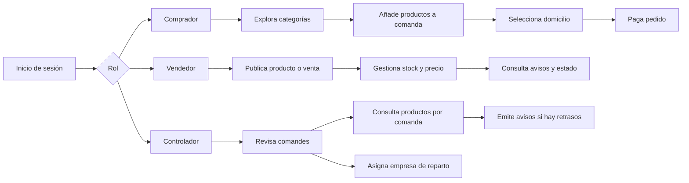
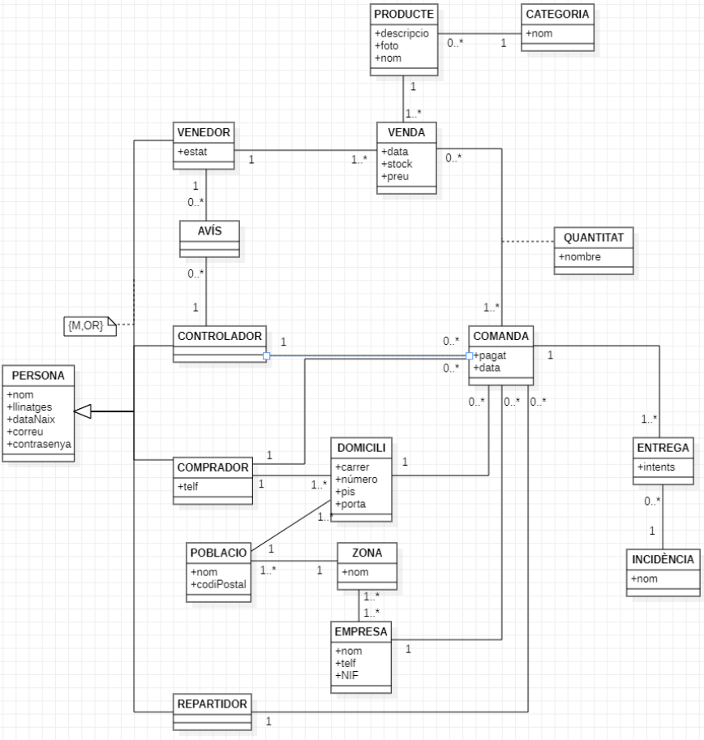

# Estimazon

<p align="center">
  
</p>

## Visión general

**Estimazon** es una plataforma web de comercio electrónico desarrollada como proyecto final de **Base de Datos II**. El sistema simula un marketplace con varias figuras operativas: **compradores**, **vendedores**, **controladores** y la capa logística asociada a **empresas, zonas, domicilios, entregas e incidencias**.

A diferencia de una tienda online sencilla, este proyecto no se limita al catálogo y al carrito. Modela también la **operativa interna** que hay detrás de una compra: altas de usuarios, gestión de domicilios, publicación de ventas por parte de vendedores, selección de empresa distribuidora, avisos a vendedores cuando una venta no llega a tiempo, actualización de estado del vendedor y copia de seguridad automática de pedidos pagados.

En otras palabras, el proyecto combina:

- **Frontend web clásico** con PHP, HTML y CSS.
- **Lógica de negocio en base de datos** con funciones, procedimientos, trigger y event de MySQL/MariaDB.
- **Modelo de datos amplio**, pensado para representar tanto la compra como la logística y el control de calidad.

---

## Qué problema resuelve

Estimazon representa el flujo completo de un marketplace académico donde:

- un **comprador** puede registrarse, añadir domicilios, navegar por categorías, añadir productos a una comanda y pagarla;
- un **vendedor** puede crear su cuenta, publicar productos, generar ventas y actualizar stock/precio;
- un **controlador** supervisa comandes, revisa productos pendientes y emite avisos a vendedores cuando hay retrasos;
- el sistema asocia la entrega a una **empresa logística** según la zona del domicilio;
- la base de datos conserva reglas de negocio críticas mediante lógica almacenada.

---

## Propuesta funcional

### Roles del sistema

#### 1. Comprador
- Registro de cuenta.
- Alta de uno o varios domicilios.
- Consulta de categorías.
- Navegación de productos por categoría.
- Filtros de listado: todos, precio mínimo, orden alfabético descendente y precio más alto.
- Creación y mantenimiento de una **comanda abierta**.
- Pago final de la comanda.

#### 2. Vendedor
- Registro de cuenta.
- Publicación de nuevos productos.
- Creación de nuevas ventas sobre productos ya existentes.
- Modificación de stock y precio de cada venta.
- Visualización de su estado como vendedor y número de avisos.

#### 3. Controlador
- Consulta de comandes asignadas.
- Revisión detallada de productos por comanda.
- Inserción de avisos a vendedores cuando una venta sigue sin fecha de llegada y han pasado más de 5 días.
- Asignación de empresa de reparto cuando aplica.

---

## Flujo de negocio



---

## Arquitectura técnica

### Stack

- **Backend:** PHP procedural
- **Frontend:** HTML + CSS
- **Base de datos:** MySQL / MariaDB
- **Gestión de datos:** SQL con funciones, procedimientos, trigger y event
- **Sesiones:** `$_SESSION` para persistir el usuario y la comanda activa

### Elementos técnicos destacados

- **18 tablas**
- **6 procedimientos almacenados**
- **5 funciones almacenadas**
- **1 trigger**
- **1 event programado**
- **29 archivos PHP** y **10 archivos CSS** en la solución final

---

## Modelo de datos

El dominio está construido alrededor de cuatro actores principales:

- `COMPRADOR`
- `VENDEDOR`
- `CONTROLADOR`
- `REPARTIDOR`

Todos heredan conceptualmente de una entidad `PERSONA`. A partir de ahí, el sistema articula el resto del negocio con estas tablas:

- `PRODUCTE`, `CATEGORIA`, `VENDA`
- `COMANDA`, `QUANTITAT`
- `DOMICILI`, `POBLACIO`, `ZONA`, `EMPRESA`
- `ENTREGA`, `INCIDENCIA`
- `AVIS`

### Decisiones de modelado especialmente interesantes

- Un **producto** puede tener **múltiples ventas**, incluso de distintos vendedores y a distintos precios.
- La comanda no guarda solo artículos: también integra **domicilio**, **controlador**, **empresa**, **repartidor** e historial de entrega.
- La tabla **QUANTITAT** resuelve la relación entre **comanda** y **venta**, guardando cuántas unidades de cada venta hay en un pedido.
- Las **zonas** permiten vincular poblaciones con empresas logísticas.
- Los **avisos** permiten gobernar la reputación del vendedor.

### Modelo conceptual

<p align="center">
  
</p>

---

## Lógica de negocio en base de datos

Una de las partes más sólidas del proyecto es que varias reglas importantes no dependen únicamente del PHP, sino que se bajan al nivel de la base de datos.

### Funciones

- `crearComprador(...)`  
  Crea un comprador si el correo no existe.

- `crearVenedor(...)`  
  Crea un vendedor si el correo no existe.

- `insereixDomicili(...)`  
  Inserta un domicilio si el código postal existe.

- `VerificarCodiPostal(...)`  
  Comprueba que el código postal está registrado.

- `VerificarUsuariContrasenya(...)`  
  Valida credenciales y tipo de usuario en el login.

### Procedimientos almacenados

- `Existeix_afegir(venda_id, id_comanda)`  
  Incrementa la cantidad de una venta ya existente en la comanda y reduce stock.

- `No_Existeix_afegir(venda_id, id_comanda)`  
  Inserta una nueva línea en `QUANTITAT` y reduce stock.

- `Llevar(venda_id, id_comanda)`  
  Elimina unidades del carrito y devuelve stock; si la cantidad queda en 0, borra la línea.

- `Inseriravis(fecha, idven, idcon)`  
  Inserta un aviso solo cuando la comanda lleva más de 5 días pendiente.

- `Actualitzar_Estat(id_vendedor)`  
  Recalcula el estado del vendedor según su número de avisos.

- `InserirResguard()`  
  Copia comandes pagadas del día a una tabla de resguardo.

### Trigger

- `Nou_Avis`  
  Tras insertar un aviso, llama automáticamente a `Actualitzar_Estat`, de forma que el estado del vendedor se actualiza sin intervención manual.

### Evento programado

- `CopiaSeguretat`  
  Ejecuta `InserirResguard()` cada día.

---

## Estructura funcional del código

La carpeta principal de ejecución es:

```text
Solució Completa/
```

Dentro de esa carpeta, el proyecto está separado por módulos funcionales, aunque en el repositorio actual varias carpetas conservan el nombre del miembro del equipo que las implementó.

```text
Solució Completa/
├── inici.php
├── procesar_login.php
├── crear_comprador.php
├── crear_controlador.php
├── connexio.php
├── BD220542095D/              # módulo comprador, catálogo, carrito
├── BD241616030Z(domicili)/    # módulo domicilios
├── BD241616030Z(Pago)/        # módulo pago
├── BD245611845Q/              # módulo vendedor
├── BD246394559V/              # módulo controlador
└── imatges/
```

### Qué hace cada bloque

- **`inici.php`**: pantalla de acceso y derivación por rol.
- **`procesar_login.php`**: autentica contra base de datos y redirige según rol.
- **Módulo comprador**: navegación por categorías, listado de productos, gestión de comanda, añadir/quitar unidades.
- **Módulo domicilios**: alta de domicilio, validación de código postal, visualización de datos del comprador.
- **Módulo pago**: selección de domicilio y confirmación del pago.
- **Módulo vendedor**: publicación de producto/venta, edición de stock y precio.
- **Módulo controlador**: consulta de pedidos, revisión de ventas, inserción de avisos y asignación de empresa.

---

## Cómo ejecutar el proyecto en local

### Requisitos

- PHP 8.x
- MySQL o MariaDB
- Apache (XAMPP, MAMP, WAMP o similar)
- phpMyAdmin opcional

### Pasos

1. Copia `Solució Completa/` dentro de tu carpeta pública del servidor web, por ejemplo `htdocs/Estimazon`.
2. Importa el archivo `bd2sacachavos.sql` en MySQL/MariaDB.
3. Revisa la configuración de conexión en `connexio.php`.
4. Abre el proyecto desde el navegador.

### Importante: ajuste necesario antes de ejecutar

En el estado actual del repositorio hay dos detalles a tener en cuenta:

#### 1. Nombre de base de datos

El dump SQL se llama y documenta como:

```sql
bd2sacachavos
```

pero `connexio.php` intenta conectarse a:

```php
estimazonfinal
```

Por tanto, hay que hacer una de estas dos cosas:

- crear la base de datos con el nombre `estimazonfinal` e importar ahí el dump, o
- modificar `connexio.php` para que apunte a `bd2sacachavos`.

#### 2. Estructura de carpetas

El código de navegación hace referencia a rutas lógicas como:

- `comprador/`
- `venedor/`
- `domicili/`
- `Pago/`
- `controlador/`

pero en este ZIP las carpetas se han entregado con nombres ligados al reparto del trabajo por miembro del equipo. Para dejar el proyecto listo para GitHub o para ejecución directa, conviene **renombrar carpetas** o **actualizar las rutas internas**.

Este punto no resta valor al trabajo: simplemente refleja que el repositorio actual es la **versión de entrega académica**, no una versión todavía paquetizada para producción.

---

## Cuentas demo incluidas en el SQL

El dump contiene datos de prueba que facilitan la demo del sistema.

### Comprador
- `alex@gmail.com` / `alex123`
- `pep@correu.com` / `pep`

### Vendedor
- `Juan_Garcia@correu.com` / `venedor1`
- `Pedro_Martinez@correu.com` / `venedor3`

### Controlador
- `carlos_gonzalez@gmail.com` / `controlador1`

> Estas credenciales son únicamente de demostración académica, extraídas del dataset de ejemplo del proyecto.

---

## Qué aporta este proyecto

### 1. Buena comprensión del dominio de negocio
No es un CRUD simple. El proyecto modela un proceso realista de marketplace: catálogo, ventas, carrito, pedido, domicilio, logística, incidencias y reputación del vendedor.

### 2. Uso serio de base de datos
La lógica no está toda en la aplicación. Se aprovechan:

- funciones,
- procedimientos,
- transacciones,
- trigger,
- event scheduler.

Esto demuestra una aproximación orientada a integridad y consistencia.

### 3. Flujo end-to-end
El sistema cubre un recorrido funcional muy amplio:

- alta de usuario,
- alta de domicilio,
- compra,
- pago,
- gestión del catálogo,
- control interno,
- seguimiento del vendedor.

### 4. Modelo multi-rol
La separación entre comprador, vendedor y controlador aporta complejidad real y hace el proyecto mucho más interesante que una tienda monolítica.

---

## Análisis técnico honesto

### Puntos fuertes

- Buen modelado relacional para un proyecto académico.
- Lógica SQL bien aprovechada para operaciones críticas.
- Flujo funcional amplio y coherente.
- Uso de transacciones en operaciones de carrito/stock.
- Separación de responsabilidades por módulos.
- Datos demo suficientes para enseñar el sistema sin tener que poblarlo manualmente.

### Aspectos mejorables

Desde una perspectiva profesional, estos serían los siguientes pasos para llevar Estimazon a un nivel más productivo:

- **Seguridad:** varias consultas interpolan variables directamente en SQL; convendría migrar de forma consistente a consultas preparadas.
- **Contraseñas:** actualmente las contraseñas están en texto plano; debería usarse hashing (`password_hash`, `password_verify`).
- **Arquitectura:** el proyecto está en PHP procedural; escalaría mejor con MVC, controladores, servicios y repositorios.
- **Estructura del repositorio:** conviene renombrar carpetas por dominio funcional y no por autor.
- **Configuración:** `connexio.php` debería usar variables de entorno.
- **UX / validaciones:** faltan validaciones más ricas en frontend y mensajes de error más homogéneos.
- **Tests:** no hay tests automáticos ni seeders separados del dump principal.

---

## Mejoras recomendadas si se quisiera evolucionar

- Refactor a **Laravel** o a una arquitectura MVC propia.
- Añadir **hash de contraseñas** y control de permisos más estricto.
- Implementar **panel de administración** con métricas.
- Separar claramente **carrito**, **checkout**, **catálogo** y **backoffice**.
- Añadir subida real de imágenes y almacenamiento en servidor o cloud.
- Incorporar **paginación**, **búsqueda** y filtros más completos.
- Añadir trazabilidad logística real: estados de envío, histórico de incidencias y SLA por empresa.
- Escribir pruebas de integración para la lógica de carrito, avisos y actualización de estado.

---

## Conclusión

Estimazon es un proyecto académico especialmente sólido para mostrar tres capacidades importantes:

1. **Diseño de bases de datos con lógica de negocio real.**
2. **Desarrollo web full-stack clásico con PHP y MySQL.**
3. **Capacidad para modelar procesos completos, no solo pantallas.**

Aunque el repositorio todavía necesita una pequeña capa de profesionalización para quedar listo de cara a producción o portfolio técnico, el núcleo del trabajo está bien planteado: hay un dominio bien pensado, una implementación funcional y un uso interesante de SQL avanzado.

Si lo publicas en GitHub acompañado de este README y una pequeña reorganización de carpetas, puede presentarse muy bien como un proyecto universitario de **backend + base de datos + lógica de negocio**.
